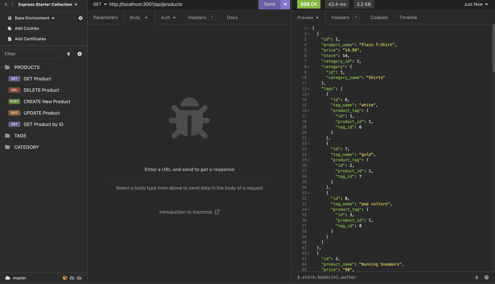
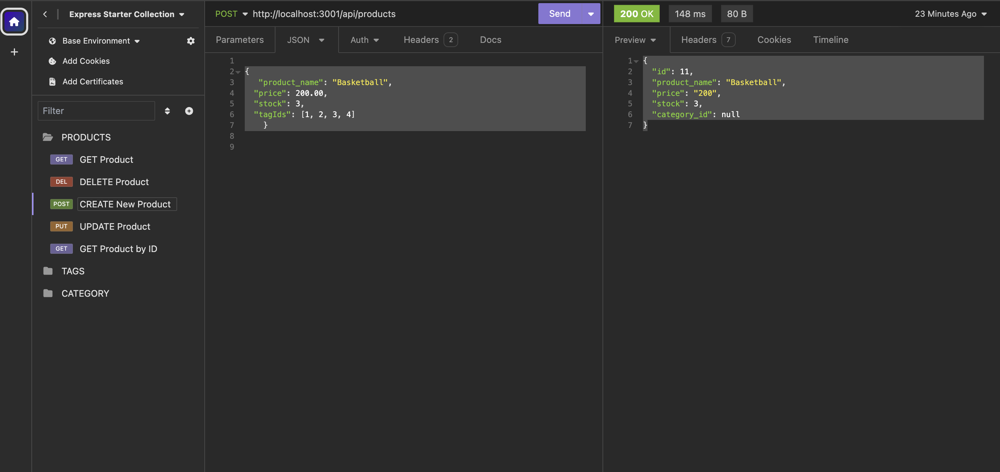
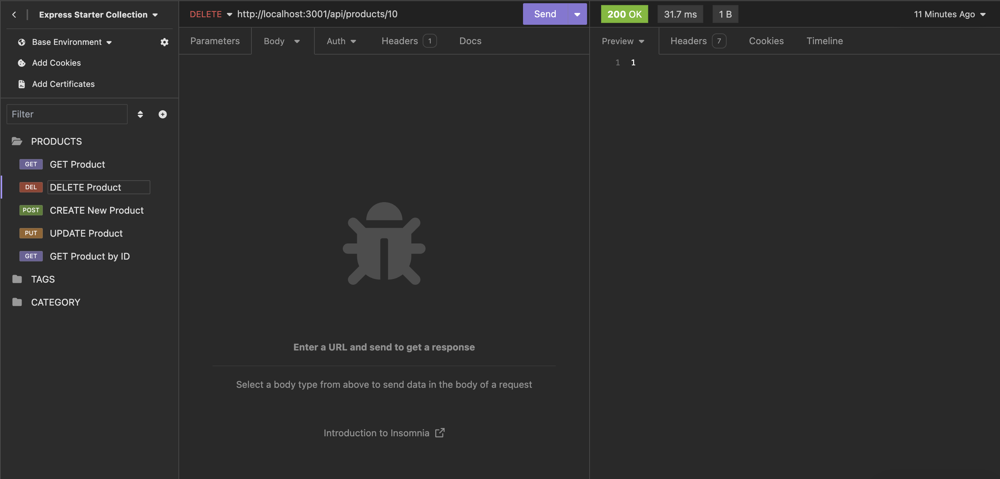
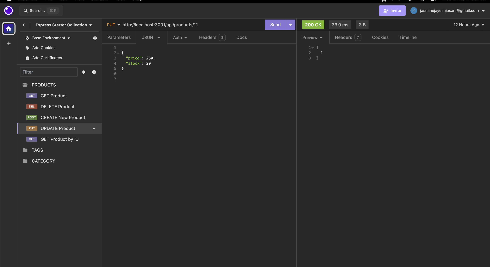

# E-Commerce Back End

This project provides a back end solution for e-commerce websites, catering specifically to managers at internet retail companies. It leverages the latest technologies to ensure competitiveness in the market.

## Features
- Allows managers at internet retail companies to set up a back end for their e-commerce websites.
- Utilizes the latest technologies to ensure competitiveness in the market.

## Installation
To install and set up the E-Commerce Back End, follow these steps:
1. Clone the repository to your local machine.
2. Navigate to the project directory.
3. Install dependencies by running `npm install`.
4. Set up your environment variables by creating a `.env` file and adding your database name, PostgreSQL username, and PostgreSQL password.
5. Ensure you have PostgreSQL installed on your system. If you do not have it installed, visit [Postrgresql Installation](https://www.postgresql.org/docs/current/tutorial-install.html) and follow the steps outlined there.
6. On your terminal, log in to Postgresql by typing `psql -U <username>`.
7. Enter your password.
8. Enter schema and seed commands to create a development database and seed it with test data. Use commands `\i` and `node` to complete this.

9. Start the application by running `npm start`.

10. If this process is successful, you will have an active listening port. Head on to Insomnia for usage

## Usage
Once the installation is complete, you can use the E-Commerce Back End to:

- Display formatted JSON data for categories, products, or tags via API GET routes in Insomnia.
- Successfully create, update, and delete data in the database using API POST, PUT, and DELETE routes in Insomnia.

## Visuals

### Backend views on Insonmia

**View all products (GET)**

**Create new product**

**Delete product by ID**

**Update product by ID**

**Create new product**

## Contributing

Contributions to this application are welcome! 

Follow these steps to contribute:

1. Fork the repository.

2. Create a new branch for your feature or enhancement.
3. Make your changes and commit them, following best practices for commit messages.
4. Push your changes to your forked repository.
5. Submit a pull request with a clear description of your changes.

## License

This project is licensed under the MIT License.

## Acknowledgements

This project was inspired by the need to increase back-end organizational efficiency of data management using Postgresql. 
Special thanks to open use softwares such as Insomnia, Express.js, Visual Studio, Postgresql. The sharing of knowledge and platforms enables a world where our focus is on growth, not competition. 